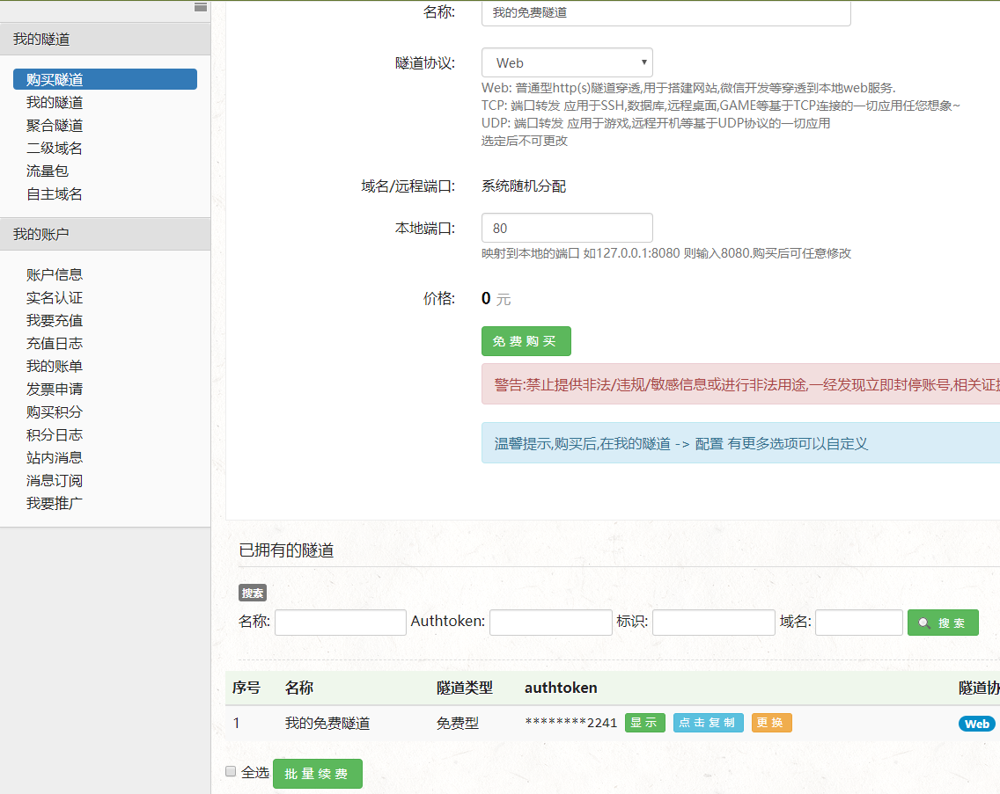
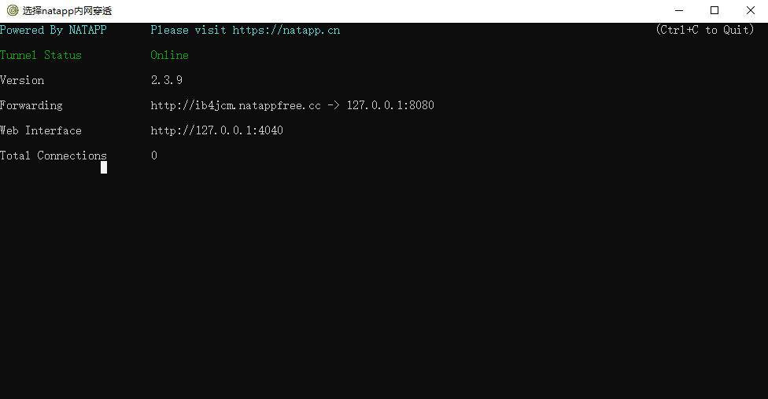
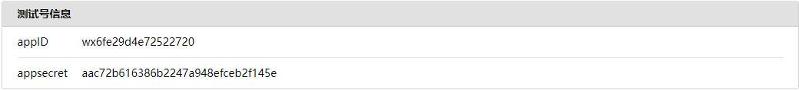
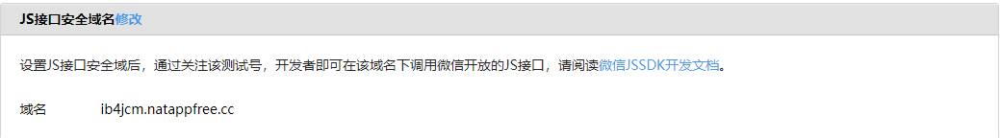
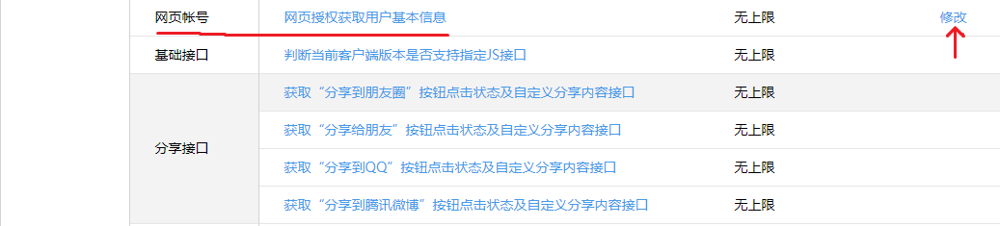
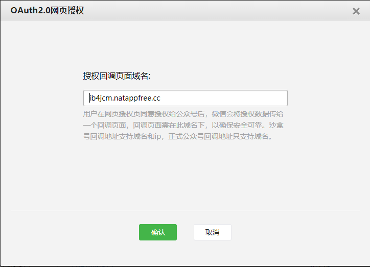
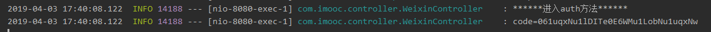
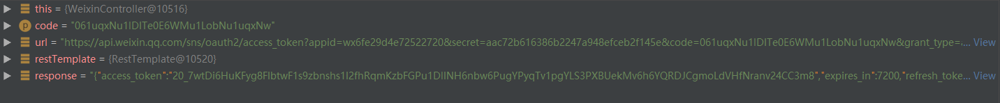

# weixin_natapp
使用natapp实现内网穿透，并利用微信测试号搭建本地微信开发

#### natapp下载
natapp官网地址：https://natapp.cn/ 下载，根据官网的1分钟快速新手图文教程 https://natapp.cn/article/natapp_newbie 进行操作即可。(注意要配置config.ini文件)

P.S. _购买隧道选择免费的就行，本地端口要根据项目运行时的具体端口设置_



安装配置好后运行即可看到如下界面，中间的网址即是外网访问你本机的网址。由于选择的是免费隧道的，你关闭后再次打开是会动态变化的网址，未完成项目操作时千万别关闭，否则项目又要重新设置对应的网址



#### 微信官网文档
微信公众平台技术文档网址：https://mp.weixin.qq.com/wiki

#### 微信公众平台测试账号
网址 http://mp.weixin.qq.com/debug/cgi-bin/sandbox?t=sandbox/login 进入注册并登录。

###### 可获取测试号信息中的appID和appsecret，如下图所示：



###### 在测试账号中还要做好以下配置
1. JS接口安全域名修改
填入项目外网访问的域名地址




2. 网页帐号修改
填入微信发送异步通知的回调地址






#### 测试
编写请求代码
```java
/**
 * Author zly
 * Description:微信控制器
 * Date: 2019/4/3 17:02
 */
@Controller
@RequestMapping("/weixin")
@Slf4j
public class WeixinController {

    @GetMapping("/auth")
    public void auth(@RequestParam("code") String code){
        log.info("******进入auth方法******");
        log.info("code={}",code);

        String url = "https://api.weixin.qq.com/sns/oauth2/access_token?appid=wx6fe29d4e72522720&secret=aac72b616386b2247a948efceb2f145e&code="+code+"&grant_type=authorization_code";
        RestTemplate restTemplate = new RestTemplate();
        String response = restTemplate.getForObject(url,String.class);
        log.info("response={}",response);
    }
}
```

在微信上打开以下网址
https://open.weixin.qq.com/connect/oauth2/authorize?appid=wx6fe29d4e72522720&redirect_uri=http://ib4jcm.natappfree.cc/weixin/auth&response_type=code&scope=snsapi_base&state=STATE#wechat_redirect

在代码出打断点，并查看控制台



